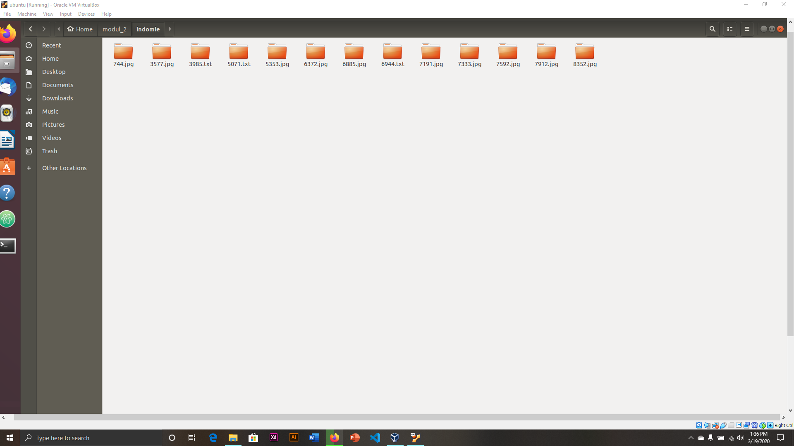

# SoalShiftSISOP20_modul2_T01

Repository ini Sebagai Laporan Resmi Soal Shift Modul 2 Praktikum Sistem Operasi 2020

## Disusun oleh : 

  - Anis Saidatur Rochma    [05311840000002]
  - Kadek Nesya Kurniadewi  [05311840000009]

## Soal 1

Buatlah program C yang menyerupai crontab untuk menjalankan script bash dengan ketentuan sebagai berikut:
**a.** Program menerima 4 argumen berupa:
```
        Detik: 0-59 atau * (any value)
        Menit: 0-59 atau * (any value)
        Jam: 0-23 atau * (any value)
        Path file .sh
```

**b.** Program akan mengeluarkan pesan error jika argumen yang diberikan tidak sesuai
**c.** Program hanya menerima 1 config cron
**d.** Program berjalan di background (daemon)
**e.** Tidak boleh menggunakan fungsi system()
Contoh: `./program \* 34 7 /home/somi/test.sh` (script bash test.sh akan dijalankan setiap jam 07.34 waktu lokal)

Pembahasan:

```c
include <stdio.h> // fungsi untuk input output, seperti sprintf
#include <stdlib.h> // library fungsi umum , seperti exit(), atoi()
#include <unistd.h> // untuk melakukan system call ke kernel linux seperrti fork()
#include <sys/types.h> // tipe data pid_t
#include <sys/stat.h>
#include <syslog.h>
#include <string.h>
#include <time.h>
```
setelah itu deklaraasi variabel pada fungsi main() 
```c
int main (int argc, char *argv[])
```
Disini masing-masing argumen akan dicek apakah sesuai dengan ketentuan yang ada.Jika argumen yang dimasukkan tidak benar, maka akan menampilkan tulisan *Argumen Salah*
```c
if (argc != 5) {
    printf("Argumen salah\n");
    exit(EXIT_FAILURE);
  }
  if (!(((atoi(argv[1]) >= 0) && (atoi(argv[1]) < 60)) || ((strcmp(argv[1],"*")) == 0))) {
    printf("Argumen pertama antara 0-59 or *\n");
    exit(EXIT_FAILURE);
  }
  if (!(((atoi(argv[2]) >= 0) && (atoi(argv[2]) < 60)) || ((strcmp(argv[2],"*")) == 0))) {
    printf("Argumen kedua antara 0-59 or *\n");
    exit(EXIT_FAILURE);
  }
  if (!(((atoi(argv[3]) >= 0) && (atoi(argv[3]) < 24)) || ((strcmp(argv[3],"*")) == 0))) {
    printf("Argumen ketiga antara 0-23 or *\n");
    exit(EXIT_FAILURE);
  }
```
* argc dan argv berperan untuk memberikan argumen yang diberikan user melalui command line.argv merupakan array yang berisikan pointer of char. Dalam penerapannya, argv dapat dipanggil seperti two-dimensional array. Contohnya seperti pada code yang diatas ya
* argv[1] akan berisi argument detik. Berfungsi untuk mengecek apakah nilainya berupa '*' atau diantara 0-59 . difungsikan untuk mengubah simbol asterisk( * ) menjadi integer value melalui fungsi atoi( ).
* argv[2] akan berisi argument menit. Berfungsi untuk mengecek apakah nilainya berupa '*' atau diantara 0-59 . difungsikan untuk mengubah simbol asterisk( * ) menjadi integer value melalui fungsi atoi( ).
* argv[3] akan berisi argument detik. Berfungsi untuk mengecek apakah nilainya berupa '*' atau diantara 0-23 . difungsikan untuk mengubah simbol asterisk( * ) menjadi integer value melalui fungsi atoi( ).

```c
struct tm tm;
  time_t varwaktu;
 ```
* Dengan menggunakan fungsi time() dan localtime() dalam library <time.h>, kita dapat menemukan waktu lokal sesuai dengan posisi kita berada. 
* Code diatas berfungsi mengeset waktu saat ini variable varwaktu dengan fungsi time(NULL). Karena format dari variable varwaktu masih dalam epoch/unix timestamp, sehingga perlu diubah ke bentuk format yang sudah terstandard. Disini kami menggunakan fungsi localtime dan memasukkannya kedalam variable tm.

```c
pid_t pid, sid; // Variabel untuk menyimpan PID
  pid = fork(); // Menyimpan PID dari Child Process

  if (pid < 0) {
     exit(EXIT_FAILURE); // Keluar saat fork gagal
  }
  if (pid > 0) {
    exit(EXIT_SUCCESS); // Keluar saat fork berhasil
  }
  umask(0);
  sid = setsid();
  if (sid < 0) {
    exit(EXIT_FAILURE);
  }

  close(STDIN_FILENO);
  close(STDOUT_FILENO);
  close(STDERR_FILENO);
```
* Code diatas merupakan Fungsi Daemon. Menurut Pengertiannya, Daemon adalah suatu program yang berjalan di background secara terus menerus tanpa adanya interaksi secara langsung dengan user yang sedang aktif.
* Fungsi `umask` digunakan untuk mengatur permission dari suatu file pada saat file itu dibuat. Di sini kita mengatur nilai umask(0) agar mendapatkan akses full terhadap file yang dibuat oleh daemon. 
* Langkah pertama adalah membuat sebuah parent process dan memunculkan child process dengan melakukan fork(). Kemudian bunuh parent process agar sistem operasi mengira bahwa proses telah selesai. Setelah itu child process akan membuat session ID (sid) menggunakan fungsi setsid(). Apabila gagal, proses tersebut langsung keluar.
* Sebuah daemon tidak boleh menggunakan terminal. Oleh sebab itu kita harus menutup file descriptor standar (STDIN, STDOUT, STDERR).
```c
  close(STDIN_FILENO);
  close(STDOUT_FILENO);
  close(STDERR_FILENO);
```

**Main Program jengjeng**
```c
  while (1) {
    varwaktu = time(NULL);
    tm = *localtime(&varwaktu);
    if ((tm.tm_sec == atoi(argv[1]) || ((strcmp(argv[1],"*")) == 0)) && (tm.tm_min == atoi(argv[2]) || ((strcmp(argv[2],"*")) == 0)) && (tm.tm_hour == atoi(argv[3]) || ((strcmp(argv[3],"*") == 0)))) {

      if (fork()==0) {
        execl("/bin/bash", "bash", argv[4], NULL);
        sleep(1);
      }
```
* Pemberian value ulang terhadap variabel varwaktu dan tm dilakukan agar program tetap update perihal *current time* meski sedang berada di dalam while.
* Melakukan comparing terhadap argumen yang dimasukkan oleh pengguna menggunakan `strcmp`. Condition yang ada di dalam if akan melakukan pengecekan. Bernilai true apabila argumen yang diinputkan sama dengan * atau waktunya sesuai dengan waktu saat ini. 
* `sleep (1)` digunakan untuk mengatur agar fungsi while berjalan setiap satu detik.

## ScreenShot


* Program tersebut menjalankan file test.sh setiap menit dan setiap jam pada jam 20 menit 27. Jika dilihat shell scritpt yang dijalankan akan terus melakukan mkdir dengan date saat ini sampai jam 20 dan menit 27 berikutnya. namun disini terlihat pada menit pertama, langsung keluar 2 folder begitu pula seterusnya. saya tidak tahu kenapa dan tidak tau salahnya dimana :(

**Isi File test.sh**


## Kesulitan
1. Bobot soalnya susah banget :") 
2. Pada saat ngerun , saya ngeset untuk tiap menit dan tiap jam. namun pada menit pertama, folder yang muncul langsung ada 2, tidak satu persatu. dan begitu seterusnya 

## Soal 2

*Shisoppu mantappu! itulah yang selalu dikatakan Kiwa setiap hari karena sekarang dia merasa sudah jago materi sisop. Karena merasa jago, suatu hari Kiwa iseng membuat sebuah program.*
[Source Code](https://github.com/anissaidatur/SoalShiftSISOP20_modul2_T01/blob/master/soal_2/dua.c)

## A 

*Kiwa membuat sebuah folder khusus, di dalamnya dia membuat sebuah program C yang per 30 detik membuat sebuah folder dengan nama timestamp [YYYY-mm-dd_HH:ii:ss].*

```C
#include <stdlib.h>
#include <sys/types.h>
#include <unistd.h>
#include <wait.h>
#include <time.h>
#include <stdio.h>
#include <string.h>
```
* Pertama-tama, kita harus input library yang diperlukan

```C
int main() {
    pid_t child_id, child_id1, child_id2, child_id3;

    int status;

    child_id1 = fork();
    if (child_id1 < 0) {
        exit(EXIT_FAILURE); // Jika gagal membuat proses baru, program akan berhenti
    }
    if (child_id1 == 0) {  
        char *argv[] = {"mkdir", "-p", "khusus", NULL};
        execv("/bin/mkdir", argv);
    }
```
* Selain input library, kita juga harus mendeklarasikan variabel yang akan digunakan seperti ` pid_t child_id, child_id1, child_id2, child_id3;`
* Kemudian kode selanjutnya dibuat untuk membuat folder bernama `khusus` pada direktori "***/home/[USER]/***"
```C
char str[50], var[100], final[100], save[100]; 
    int a; // untuk t=(t%1000)+100
    time_t t, w; //deklarasi variabel
    t = time(NULL);
    struct tm *tm, *wm; 
    
    tm = localtime(&t);
    strftime(str, 50, "khusus/%Y-%m-%d_%H:%M:%S", tm);
```
* kita harus mendeklarasikan string terlebih dahulu :
  `str[50]` adalah besar string untuk nama folder,
  `var[100]` adalah besar string untuk urlnya,
  `final[100]` adalah besar string untuk nama filenya,
  `save[100]` adalah gabungan dari str(nama folder) dan file(nama file).
```C
child_id2 = fork();
	if (child_id2 < 0) {
		exit(EXIT_FAILURE); // Jika gagal membuat proses baru, program akan berhenti
	}
	if (child_id2== 0) {
		char *argv[] = {"mkdir", "-p", str, NULL};
		execv("/bin/mkdir", argv);
	}
```
* variabel `t` digunakan untuk menyimpan timestamp dalam format epoch
* variabel `tm` digunakan untuk menyimpan timestamp yang sudah sesuai dengan localtime
* `strftime` digunakan untuk melakukan formating dari waktu `tm` menjadi string sesuai dengan format yg diminta (YYYY-mm-dd_HH:ii:ss) ke dalam buffer str sebesar 50.
* Kode diatas merupakan kode yang akan membuat folder baru di dalam folder **khusus** yang nantinya nama folder tersebut sesuai dengan timestamp sesuai dengan format yang diminta yaitu ***(YYYY-mm-dd_HH:ii:ss)***
### Screenshots
   1. Setelah program sudah dicompile dan sudah di run, maka nanti pada ***/home/[USER]/*** ada folder baru dengan nama `khusus`
   


   2. Jika folder khusus tersebut dibuka, akan ada folder baru dengan format nama timestamp ***(YYYY-mm-dd_HH:ii:ss)***
   


## B

*Tiap-tiap folder lalu diisi dengan 20 gambar yang di download dari https://picsum.photos/, dimana tiap gambar di download setiap 5 detik. Tiap gambar berbentuk persegi dengan ukuran **(t%1000)+100 piksel** dimana t adalah detik Epoch Unix. Gambar tersebut diberi nama dengan format timestamp [YYYY-mm-dd_HH:ii:ss].*

* soal nomor 2B ini merupakan lanjutan dari soal nomor 2A dan saling berhubungan sehingga code yang dibuat menjadi satu, untuk memenuhi permintaan soal nomor 2B ini memiliki source code seperti dibawah ini :
```C
	child_id3 = fork(); 
	
	if (child_id3 < 0) {
	    exit(EXIT_FAILURE);
	}
	int i;
	for (i=0;i<20;i++) {
		w = time(NULL);
		wm = localtime(&w);		
		a = (w%1000)+100;
		sprintf (var, "https://picsum.photos/%d", a); //link download yang akan dituju
		strftime(final, 50, "%Y-%m-%d_%H:%M:%S", wm);
		sprintf (save, "%s/%s", str, final); 
		char *args[] = {"wget", "-O", save, var, NULL}; 
		if (fork()==0) execv("/usr/bin/wget", args);
		sleep(5);
	}    
}
```
* `child_id3` ini merupakan step untuk melakukan penyimpanan gambar yang akan di download pada link **https://picsum.photos/** dan nantinya akan disimpan didalam folder baru `child_id2` dengan format nama timestamp yang merupakan child dari `child_id1` yaitu folder dengan nama `khusus`
* pada langkah ini, kita melakukan looping sebanyak 20 kali karena maksimal gambar yang akan disimpan pada `child_id3` maksimal 20 gambar. Gambar yang nantinya akan didownload memiliki format nama timestamp yaitu ***%Y-%m-%d_%H:%M:%S***
```c
if (fork()==0) execv("/usr/bin/wget", args);
```
* perintah diatas merupakan perintah untuk melakukan downloading dengan waktu download 5 detik setiap gambarnya menggunakan perintah `sleep(5);`

### Screenshot
Screenshot 20 gambar dengan format nama timestamp yang terletak dalam folder baru didalam folder khusus dengan format nama timestamp


## Kesulitan
1. Soal yang rumit , susah, level soalnya tinggi sedangkan kami masih pengguna pemula ubuntu 
2. Waktu yang diberikan untuk mengerjakan soal shift hanya sebentar jadi tidak sempat mencoba nomor 2cd dan e

## Soal 3

*Jaya adalah seorang programmer handal mahasiswa informatika. Suatu hari dia memperoleh tugas yang banyak dan berbeda tetapi harus dikerjakan secara bersamaan (multiprocessing).*

[Source Code](https://github.com/anissaidatur/SoalShiftSISOP20_modul2_T01/blob/master/soal_3/jaya112.c)
### Library yang digunakan

```C
#include <stdlib.h>
#include <stdio.h>
#include <sys/types.h> //pid_t
#include <unistd.h> //fork()
#include <syslog.h>
#include <wait.h>
#include <dirent.h>
#include <sys/unistd.h>
#include <sys/wait.h>
```

## A

*Program buatan jaya harus bisa membuat dua direktori di ***/home/[USER]/modul2/***. Direktori yang pertama diberi nama **indomie**, lalu *lima detik* kemudian membuat direktori yang kedua bernama **sedaap**.

```C	
int main() {
	pid_t child_id,child_id2,child_id3;

	int status;

	child_id = fork();
  
	if (child_id < 0) {
		exit(EXIT_FAILURE); // Jika gagal membuat proses baru, program akan berhenti
	}

	if (child_id == 0) {
	// this is child
		char *argv[] = {"mkdir", "-p", "indomie", NULL};
		execv("/bin/mkdir", argv);
	} else {
	// this is parent
	  while ((wait(&status)) > 0);
	  child_id2 = fork();
  
	if (child_id2 < 0) {
    		exit(EXIT_FAILURE); // Jika gagal membuat proses baru, program akan berhenti
 	}

 	if (child_id2 == 0) {
    	// this is child
    		sleep (5);
		char *argv[] = {"mkdir", "-p", "sedaap", NULL};
		execv("/bin/mkdir", argv);
 	 } 
```

* `pid_t child_id,child_id2,child_id3;` untuk menyimpan PID (Parent ID) di masing-masing variabel child. sedangkan untuk `int status` berfungsi untuk deklarasi variabel status bertipe integer.
* membuat direktori pada `/home/nisyua/modul_2/ ` bernama **indomie** menggunakan perintah `mkdir`dan terdapat argumen `-p` yang berfungsi untuk membuat directory pada `/home/nisyua/modul_2` yang belum terbuat.
* syntax argument : `argv[n] = { {your-program-name}, {argument[1]}, {argument[2]},.....,{argument[n-2]}, NULL };`
* parent process menunggu directory baru terbuat, setelah itu sleep(5) atau selang 5 detik parent process membuat child process lagi untuk membuat direktori baru yaitu **sedaap** perintah tersebut disimpan dalam  `argv`


## B

*Kemudian program tersebut harus meng-ekstrak file jpg.zip di direktori ***/home/[USER]/modul2/***. 

```C
child_id3 = fork();
  
	if (child_id3 < 0) {
 		exit(EXIT_FAILURE); // Jika gagal membuat proses baru, program akan berhenti
	 }

	if (child_id3 == 0) {
    	// this is child
		char *argv[] = {"unzip", "jpg.zip", NULL}; //
		execv("/usr/bin/unzip", argv);
	}
```

* `if (child_id3 == 0)` maka proses berhasil/dapaat dijalankan. 
* Untuk mengekstrak file **jpg.zip** menggunakan perintah `unzip` yang dieksekusi oleh `execv("/usr/bin/unzip", argv);`


## C

*Diberilah tugas baru yaitu setelah di ekstrak, hasil dari ekstrakan tersebut (di dalam direktori "***/home/[USER]/modul2/jpg/"***) harus dipindahkan sesuai dengan pengelompokan, semua file harus dipindahkan ke "***/home/[USER]/modul2/sedaap/***" dan semua direktori harus dipindahkan ke "***/home[USER]/modul2/indomie/***".

```C
child_id4 = fork();

	if (child_id4 < 0){
		exit(EXIT_FAILURE);
	}

	if (child_id4 == 0){
		execl("/usr/bin/find", "find", "/home/nisyua/modul_2/jpg", "-type", "f", "-name", "*", "-exec", "mv", "-t", "/home/nisyua/modul_2/sedaap", "{}", "+", (char *) NULL);
	} else {
	while ((wait(&status)) > 0);
	  child_id5 = fork();

	if(child_id5 < 0) {
		exit(EXIT_FAILURE);
	}

	if(child_id5 == 0) {
		execl("/usr/bin/find", "find", "/home/nisyua/modul_2/jpg/", "-mindepth", "1", "-type", "d", "-name", "*", "-exec", "mv", "-t", "/home/nisyua/modul_2/indomie/", "{}", "+", (char *) NULL);
	}
```
* Pada proses `if (child_id4 == 0)` , `find` di jpg yang bertipe file dengan semua nama di direktori ***/home/nisyua/modul_2/jpg*** setelah itu `move` semuanya ke ***sedaap*** dan tunggu selama 2detik. 
* Sama seperti child_id4, pada proses `if(child_id5 == 0)` juga sama sistemnya. `find` di jpg yang bertipe direktori pada ***/home/nisyua/modul_2/jpg***, lalu pindahkan semua ke direktori ***indomie***

## D
*Untuk setiap direktori yang dipindahkan ke "***/home/[USER]/modul2/indomie/***" harus membuat dua file kosong. File yang pertama diberi nama **coba1.txt**, lalu 3 detik kemudian membuat file bernama **coba2.txt**. (contoh : "***/home/[USER]/modul2/indomie/{nama_folder}/coba1.txt***").

```C
child_id6 = fork();

	if (child_id6 < 0) {
		exit(EXIT_FAILURE);
	}

	if (child_id6 == 0) {
		execl("/usr/bin/find", "find", "/home/nisyua/modul_2/indomie", "-mindepth", "1", "-type", "d", "-name", "*", "-exec", "sh", "-c", "for d; do touch $d/coba1.txt;done", "{}", "+", (char *) NULL);
	} else {
	while(wait((&status)) > 0);
	sleep(3);
	execl("/usr/bin/find", "find", "/home/nisyua/modul_2/indomie", "-mindepth", "1", "-type", "d", "-name", "*", "-exec", "sh", "-c", "for d; do touch $d/coba2.txt;done", "{}", "+", (char *) NULL);
```
* Terdapat fungsi `find` yang berfungsi untuk mencari semua nama yang bertipe direktori di ***/home/nisyua/modul_2/indomie*** 
* Pembuatan file ***coba1.txt*** menggunakan perintah `touch()`, dan di eksekusi menggunakan perintah `execv()` pada setiap direktori yang ada
```C
"-exec", "sh", "-c", "for d; do touch $d/coba1.txt;done", "{}", "+", (char *) NULL);
```
* Sleep(3) atau selang 3 detik, akan membuat file ***coba2.txt*** menggunakan perintah `touch()`, dan di eksekusi menggunakan perintah `execv()` pada setiap direktori yang ada
```C
"-exec", "sh", "-c", "for d; do touch $d/coba2.txt;done", "{}", "+", (char *) NULL);
``` 

## Screenshots





## Kendala 

Kendala yang dialami :
1. Bobot soal yang sangat sulit bagi kami untuk dikerjakan
2. Soal yang dibuat terlalu belibet
3. Soal yang terlalu banyak dan susah, selain itu kami belum terbiasa dengan fungsi-fungsi program c yang bisa digunakan di ubuntu sehingga kami susah untuk mengerjakan semua soal dan membutuhkan waktu yang cukup lama untuk mengerjakannya
4. Jarak yang cukup jauh mengakibatkan kami susah untuk berkordinasi satu dengan yang lain karena Covid-19 .
